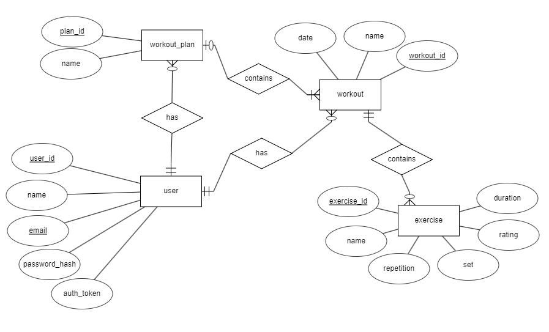

# ClosedAI

## Fitness Tracker Documentation 🏃💨

[TOC]

## Introduction

The fitness tracker consist of 3 repositories

- [Documentation (this)](https://github.com/trzero0/ClosedAI)
- [Frontend](https://github.com/MughalAman/ClosedAI-Fitness-Tracker)
- [Backend](https://github.com/MughalAman/ClosedAI-Fitness-Tracker-API)

## Diagrams & Schemas

### System structure

[](https://mermaid.live/edit#pako:eNpVkcFqwzAMhl9F-NRC2QPk1q10K2yQ0Wsuqq2m3mIrkxRGKH33OQssqw7G_v9Plvl9dZ4DucqlmEPCvskAwmyr1VPHSmF7gHO0TKpggv4z5hZ0VKMEajJ4G4TW66kL4IXVij8fphLKgeTBc5q1HRqeUGkhnpnbjqDMGgIc318XZ6q6XNgK6Vc367XwB3nThdoLZytT7vuE0Bt80wmw7xfrsby_sLCtD_d8P9qFM-xR7c_7v7qNSyQJYyhBXSetcXahRI2ryraL7cUa1-RbAXEwPo7Zu6rEQxs39AGNdhFbweSqM3ZaVArRWN7m6H9_4PYDCUB4yQ)

### Database

#### Entity Relationship Diagram

[](./ClosedAI%20fitness%20tracker%20ER.erdplus)

#### Relational Schema

[](./ClosedAI%20fitness%20tracker%20RS.erdplus)

## Code

### Database table creation sql

```sql
CREATE TABLE user
(
  user_id INT NOT NULL,
  name VARCHAR(50) NOT NULL,
  email VARCHAR(255) NOT NULL,
  password_hash VARCHAR(500) NOT NULL,
  auth_token VARCHAR(500) NOT NULL,
  PRIMARY KEY (user_id),
  UNIQUE (email)
);

CREATE TABLE workout_plan
(
  plan_id INT NOT NULL,
  name VARCHAR(500) NOT NULL,
  user_id INT NOT NULL,
  PRIMARY KEY (plan_id),
  FOREIGN KEY (user_id) REFERENCES user(user_id)
);

CREATE TABLE workout
(
  workout_id INT NOT NULL,
  name VARCHAR(50) NOT NULL,
  date DATE NOT NULL,
  user_id INT NOT NULL,
  plan_id INT,
  PRIMARY KEY (workout_id),
  FOREIGN KEY (user_id) REFERENCES user(user_id),
  FOREIGN KEY (plan_id) REFERENCES workout_plan(plan_id)
);

CREATE TABLE exercise
(
  exercise_id INT NOT NULL,
  name VARCHAR(50) NOT NULL,
  set INT NOT NULL,
  repetition INT NOT NULL,
  rating FLOAT NOT NULL,
  duration INT NOT NULL,
  workout_id INT NOT NULL,
  PRIMARY KEY (exercise_id),
  FOREIGN KEY (workout_id) REFERENCES workout(workout_id)
);
```
